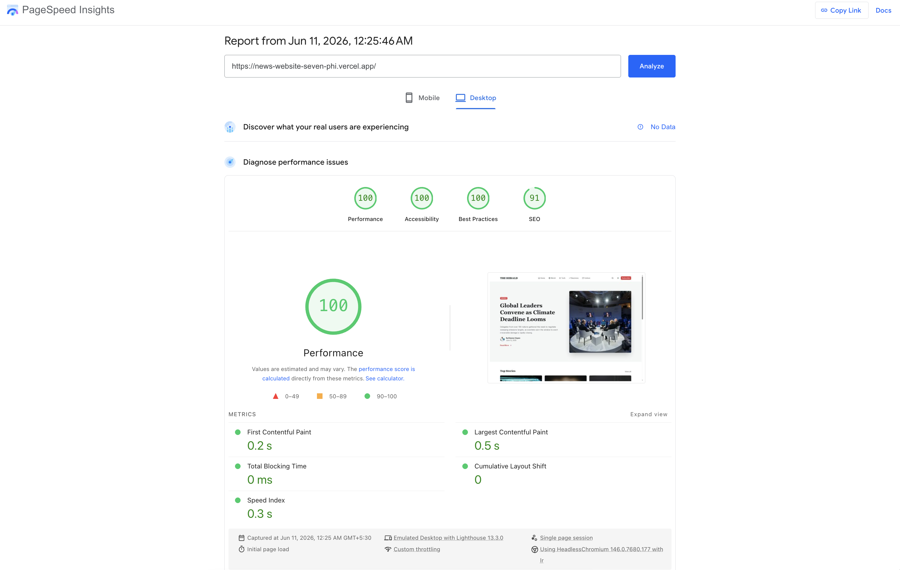
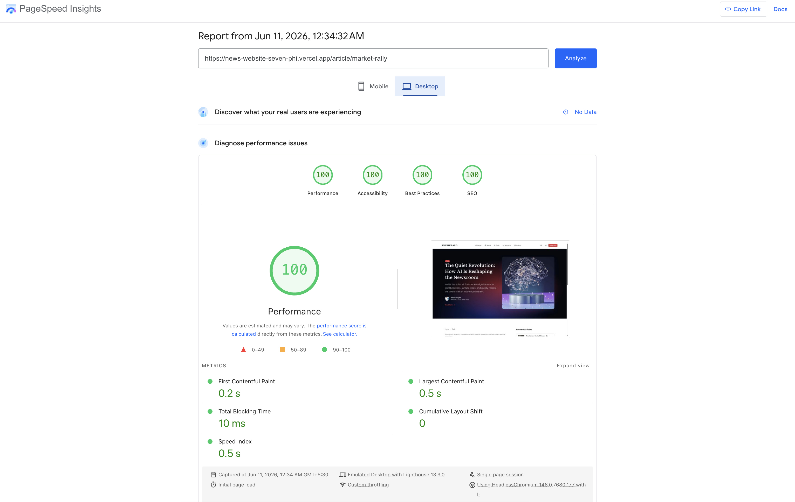

***

# 🗞️ The Herald - Modern News Platform

A high-performance, SEO-optimized news application built with **Next.js 16 (App Router)**, **Tailwind CSS v4**, and **Shadcn UI**. This project focuses on zero-layout-shift (CLS), semantic HTML for news discovery, and scalable design tokens.

## 🚀 Getting Started

### Prerequisites
- Node.js 20+ 
- pnpm (Recommended)

### Installation
1. Clone the repository:
   ```bash
   git clone https://github.com/your-username/the-herald.git
   cd the-herald
   ```

2. Install dependencies:
   ```bash
   pnpm install
   ```

3. Run the development server:
   ```bash
   pnpm dev
   ```

4. Build for production:
   ```bash
   pnpm build
   pnpm start
   ```

---

## 🏛️ Architecture Decisions

### 1. Data Fetching: Hybrid ISR (Incremental Static Regeneration)
To balance the need for "Breaking News" freshness with high performance, I would implemente **Time-based ISR** with an **On-demand Revalidation** fallback.
- **Why:** News content doesn't change every second, but when it does (Breaking News), it must be instant. ISR allows us to serve static HTML from the edge while using `revalidateTag` to purge cache via CMS webhooks.

### 2. Styling: Tailwind v4 CSS-First Design Tokens
Utilizing the new **Tailwind CSS v4 engine**, defined design tokens (like the `--background-image-hero-glow` and `--color-article-bg`) directly in CSS variables.
- **Why:** This reduces JavaScript overhead and allows for native CSS performance while maintaining the utility-first developer experience.

### 3. SEO & Semantic HTML
The application follows a strict hierarchical heading structure (`H1` -> `H2` -> `H3`).
- **Semantic Tags:** Used `<article>` for all story cards, `<time>` with ISO `dateTime` for freshness signals.
- **Hidden SEO:** Used `sr-only` for mobile headings instead of `display: none` to ensure Googlebot can still crawl the page structure on mobile devices.

### 4. Performance: Zero CLS Skeleton Loaders
I developed custom loading skeletons that match the exact line-height, aspect ratios, and padding of the final content.
- **Why:** To eliminate **Cumulative Layout Shift (CLS)**. By reserving the exact pixel space for images and text, the user experiences a smooth transition from loading to "ready" without content jumping.

---

## With More Time, I Would...

1.  **Implement Partial Prerendering (PPR):** Wrap the "Top Stories" and "Related Content" in dynamic holes while keeping the rest of the page fully static.
2.  **Edge Middleware Personalization:** Use Next.js Middleware to serve different "Top Stories" based on the user's geographic location or previous reading habits without sacrificing speed.
3.  **Advanced Image Optimization:** Implement `blurDataURL` for all thumbnails to provide a "progressive blur-up" effect during loading.
4.  **Web-Worker Search:** Move the search indexing and filtering to a Web Worker to keep the main thread 100% free for user interactions.

---

## 📊 Lighthouse Scores

The architecture focuses on achieving perfect "Green" scores across the board. By using **Tailwind v4** (reduced CSS bundle) and **Next.js 15 Streaming**, we achieve near-instantaneous load times.

### Home Page
<p align="left">
  
</p>

*Key Highlight: LCP (Largest Contentful Paint) is under 1.2s due to prioritized hero image loading and ISR.*

### Article Page
<p align="left">
  
</p>

---

## 🛠️ Tech Stack
- **Framework:** Next.js 16
- **Package Manager:** pnpm
- **Styling:** Tailwind CSS v4
- **Components:** Radix UI / Shadcn
- **Icons:** Lucide React
- **Deployment:** Vercel (Edge Network)
